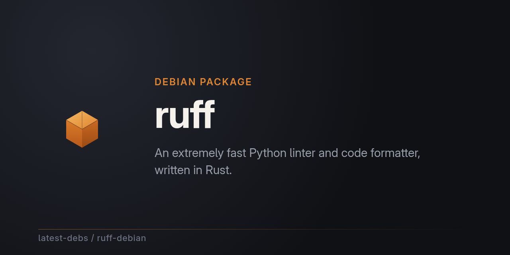

# ruff for Debian

[ruff](https://github.com/astral-sh/ruff) — an extremely fast Python linter
and code formatter, written in Rust — packaged for Debian as part of
[latest-debs](https://github.com/latest-debs).

## Install

Via the latest-debs apt repository:

```sh
sudo extrepo enable latest-debs
sudo apt update
sudo apt install ruff
```

Or download a `.deb` from the [Releases](https://github.com/latest-debs/ruff-debian/releases) page:

```sh
sudo dpkg -i ruff_*.deb
```

## Supported distributions & architectures

- Debian Bookworm (12), Trixie (13), Forky (14/testing), Sid (unstable)
- amd64, arm64, armhf, i386 (bookworm/trixie), ppc64el, riscv64, s390x

## Building

Run the [Build ruff for Debian](../../actions) workflow on GitHub with the
desired upstream version. Packaging is driven by
[debian-multiarch-builder](https://github.com/ranjithrajv/debian-multiarch-builder).

## Collaborate with us

latest-debs is a community effort — nobody "owns" this package and there's
no application to fill out. If you rely on it and want to help keep it
fresh, watching for a new upstream release or fixing a build hiccup, jump
in. Open an issue, send a PR, or drop into
[org discussions](https://github.com/orgs/latest-debs/discussions). Every
bit of help keeps this useful for everyone else who `apt install`s it.

## Disclaimer

Unofficial packaging only. For issues with ruff itself, see
[astral-sh/ruff](https://github.com/astral-sh/ruff).
